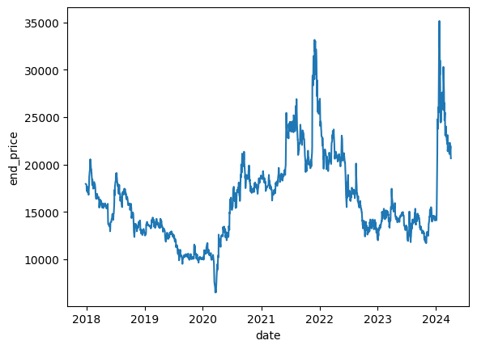
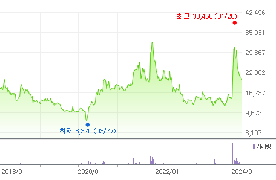
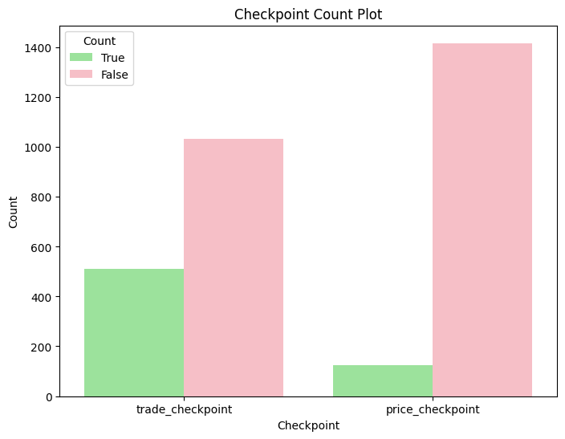
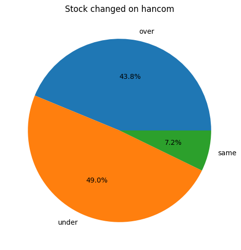
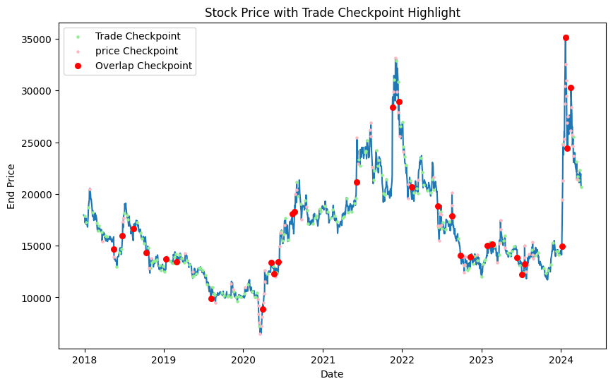
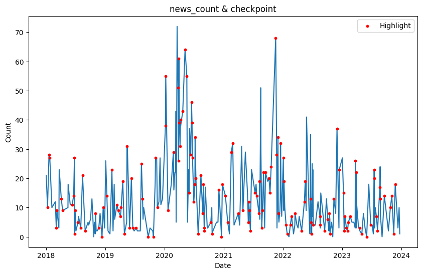
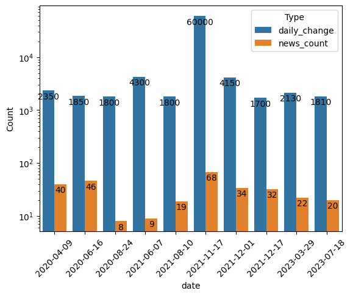
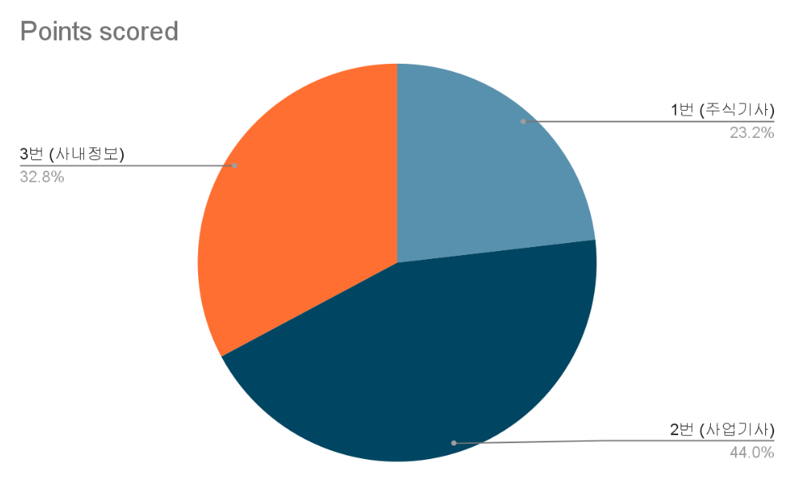

# 주식과 뉴스의 만남 주스

## 1. 프로젝트 소개

오늘도 킹킹반영을 하지못해 주식에서 돈을 꼴아버린 나는야 개미...
도대체 킹킹반영을 못해서 뉴스가 나오면 이미 다 끝나버린 주식들...
도대체 그 상관관계에는 뭐가 있을까 너무 궁금해졌다.

### 팀원 소개
|이름|담당|비고|
|--|--|--|
|박요한|크롤링, 분석, 스케쥴링, 기획|kdtyohan@gmail.com|
|김하늘|크롤링|adsky0309@gmail.com|
|노주현|크롤링|njh2720@gmail.com|

## 2. 목표
### 가정
- 마케팅 뉴스는 주가에 영향을 줄 것이다.
### 분석대상
- 주가에 영향이 있었던 날의 뉴스들에 대한 토픽을 분석
    + 토픽에 따라 마케팅에 효율적으로 사용할 수 있는 요소들이 무엇인지 알아보자

## 3. 데이터 수집

대상 사이트(뉴스) : [다음뉴스](https://search.daum.net/search?w=news&nil_search=btn&DA=NTB&enc=utf8&cluster=y&cluster_page=1&q=%ED%95%9C%EA%B8%80%EA%B3%BC+%EC%BB%B4%ED%93%A8%ED%84%B0)

대상 사이트(주식정보) : [네이버증권](https://finance.naver.com/item/sise.naver?code=030520)


|담당|수집 대상(기간)|코드|
|--|--|--|
|박요한|2022.01 ~ 2023.12|[news](./selenium/yohan/stock_news.py) / [stock](./selenium/yohan/get_stock.py)|
|김하늘|2018.01 ~ 2019.12||
|노주현|2020.01 ~ 2021.12||

## 4. 분석
|내용|산출물|코드|
|--|--|--|
|뉴스 전처리|[뉴스 카운팅.pkl](./analysis/yohan/pickles/check_count.pkl) / [뉴스 데이터.pkl](./analysis/yohan/pickles/news_data.pkl)|[ipynb](./analysis/yohan/news_analysis.ipynb)|
|주가정보 전처리|[주가 데이터.pkl](./analysis/yohan/pickles/stock_data.pkl) / [체크포인트 날짜.pkl](./analysis/yohan/pickles/date_dataframe.pkl)|[ipynb](./analysis/yohan/sotck_analysis.ipynb)|
|토픽 분석||[ipynb](./analysis/yohan/total_analysis.ipynb)|


 
```
네이버 주식 그래프와 비교했을 때, 큰 오류는 보이지 않는다.
```
 
```
[그래프 1] Checkpoint Count Plot
거래량의 변화가 많은 날보다 가격의 변화가 많은 날이 적다.
-> 실제로 거래가 많이 일어나도 가격의 변화에 크게 작용하지 않는다

[그래프 2] Stock Changed on hancom
전일비 가격이 같거나 줄어든 날이 높아졌던 날보다 더 많은 것을 확인
현재 주식가는 확인한 날짜보다 높은 상태
-> 하락 시 가격방어가 잘 되었다 or 상승시 큰폭으로 상승하였다.


해석 : 거래가 많이 일어난 날이 많았으므로, 하락시에도 많은 거래를 통해 가격방어가 잘 이뤄졌었을 것이라고 예상할 수 있다.
```


```
붉은 점이 눈여겨볼만한 곳 - 가격과 트레이딩이 모두 외부요인이 작용했다고 여겨지는 날짜
```


```
체크 포인트별 뉴스 갯수 확인 결과 310일 중 9일을 제외하고 해당 날짜에 뉴스가 존재하는것을 확인
하이라이트는 긍정적인 결과(전일비 양값)가 일어난 곳을 표시

그래프를 확인한 결과, 뉴스의 갯수가 적었을 때에도 긍정적인 결과가 발생한 날이 매우 많았음
-> 해당 일의 전날의 영향을 이어받았을 수도 있음
```

## 토픽 추출
```
- 사용 모델 : sklearn.LatentDirichletAllocation
- 평가 모델 : gensim.coherencemodel
- Tokenizer : Okt
- Vectorizer : sklearn.TfidfVectorizer
```
### 5개 미만
- 기사의 갯수가 5개 미만이라면 해당 기사가 매우 크게 작용했다고 가정
- 전날의 기사에 영향을 받을 수도 있으므로 5개 미만 기사 중 이전날 기사가 5개 이상인 날짜들은 제외
- 결과, 총 3일만 유효한 날이라고 확인하였음

- 토픽 분석 결과

|날짜|기사 수|분석 결과|
|--|--|--|
|2020-09-03|2|52주 신고가 달성 기사만 있는 것으로 보아 테마주 or 마케팅이 아닌 다른 외부요인(실적 발표 등)이 작용한 것으로 판단|
|2022-01-28|1|기사 내 한컴라이프케어(6개월 연장, 8월 예정) 즉, 락업이 연장되는 것이 주요 작용을 한것으로 예상|
|2022-02-15|4|싸이월드에 관련된 기사가 많음, 해당 시기 메타버스 및 NFT의 주요 투자 시기였다는 것을 감안하면 메타버스 테마주로써 작용한 것으로 판단|

### 5개 이상
- 전일비가 가장 크게 오른 상위 10일을 추출하여 해당 날짜의 뉴스 토픽 분석



```
최고점으로 2021-11-17일 68개의 뉴스가 발행되었으며 전일비 6만원이 상승하였다.
```

|날짜|주요 토픽|분석 결과|
|--|--|--|
|2020-04-09|시스템, 기관, 외국인, os, mds|한컴자회사 한컴MDS기사가 주요하였고, 기관과 외국인의 매수가 이루어 졌던것이 기사로 나와 유효했다고 판단|
|2020-06-16|pbr, per, 한화, 외국인, 홀딩스, 이화, 씨아이, 해태|한컴 기업에 대한 기사가 아니라 고가 달성에 의한 주식정보 기사로 판단|
|2020-08-24|마스크, 소프트웨어, 보이, 상반기, 판매량, os, pbr|코로나 기간 마스크 수혜주로 인한 기사로 판단|
|2021-06-07|매도, 거래, 코스닥, saas, 아로와나, 외국인, 투자자|코인 상승장에 의한 아로와나 코인의 테마 수혜기사로 판단|
|2021-08-10|클라우드, 네트워크, 제휴, 증권, 과학기술, 사업|한컴의 클라우드 사업확장 기사가 유효한 것으로 판단|
|2021-11-17|싸이월드, 메타버스, nft, 플랫폼, 서비스|nft급등 시기의 싸이월드와 메타버스 기사로 판단|
|2021-12-01|싸이월드, 메타버스, 소프트웨어, 코엑스|nft급등 시기의 싸이월드와 메타버스 기사로 판단|
|2021-12-17|싸이월드, 메타버스, 베타, sns|몇달간 계속 지속되는 것으로 보아 이 기간 매우 큰 효과를 누렸을 것|
|2023-03-29|ai, 클라우드, 교육, 하이퍼, 지니|23년 gpt붐과 네이버 하이퍼클로바 도입으로 인한 상승기사로 판단 |
|2023-07-18|ai, 자회사, 소각, 예정, 공시|한컴의 기업상황(사업부문 물적분할)에 의한 상승효과|

```
각 날짜에 대한 내용을 따르면 총 3가지 형태로 볼 수 있다.
1. 실적에 대한 급등주 or 테마주로 인한 주식 기사효과
    -> 이 경우 마케팅에 사용하기 어렵고, 비용도 크게 발생하지 않았을 것
2. 사업 진행에 대한 기대 기사효과
    -> 마케팅에 대한 주요한 효과가 나타나는 구간이며, 기업간 협업과 당시 주요 메타가 주요
3. 사내 기업상황에 대한 기대 기사효과
    -> 기타 사내구조에 대한 상승 기사로, 주주와 투자에 유리한 발표
```

## 결론
### 토픽의 효과가 좋았다고 생각되는 뉴스 발행 5개 미만의 형태 비율

|형태|기사수 합계|전일비 합계|날짜 개수|
|--|--|--|--|
|1|2|750|1|
|2|4|1400|1|
|3|1|1200|1|

### 뉴스 발행 5개 이상 날짜에서 전일비 top 10의 형태 비율

|형태|기사수 합계|전일비 합계|날짜 개수|
|--|--|--|--|
|1|94|6000|3|
|2|184|74080|6|
|3|20|1810|1|


- 토픽의 효과 부분에서는 메타버스,nft같은 당시 메타에 대한 사업의 토픽이 높은 전일비를 상승시키는데 도움을 주었다.

- 발행량 분에서는 이상치였던 최대값(68개 뉴스, 60000원 전일비)를 제외하고 비율을 계산해보자.
- 전일비 가격을 기사의 갯수로 나눈 값의 비율을 표현


```
이 경우에도 사업기사(메타에 대한 사업)의 효과가 다른 기사들보다 비율적으로 높은 것을 확인할 수 있다.
```

따라서, 사내정보나 주식기사보다는 당시 메타에 대한 사업 기사가 효율적이므로 초기 세웠던 가정은 참이라고 생각해볼 수 있다.

## 후기
### 발생했던 문제점과 해결방안

|발생단계|내용|해결|고찰|
|--|--|--|--|
|LDA|클러스터링 최적화를 위한 평가가 다른 라이브러리에 있음|sklearn lda데이터를 gensim 모델에 맞춰 적용|sklearn.LDA를 사용했지만 gensim.LDA를 사용했다면 더 편했을까? 다른 평가지표를 사용해보면 어땠을까?|
|LDA|동일한 기사에 대한 다수의 동일 토픽 발생|의심부분을 직접 확인|TF-IDF를 사용해서 발생한 문제일지도 모르겠음, 기사 수도 중요하다고 생각해서 중복(비슷한 내용)기사에 대한 처리를 따로 하지 않았는데 LDA진행시 처리를 했었어야했을까 한다면 코사인유사도로 처리하는 방안을 사용해보지 않았을까?|
|분석|전일비와 뉴스 갯수, 토픽의 상관관계에 대한 연관성이 약함|뉴스 갯수를 기준으로 그룹화|전일비에 대한 계산이 일반투자자,기관,외국인에 대한 데이터가 있었다면 더 정확했을 것같다.|
|분석|분석대상 날짜에 대한 기준|해당 날짜 2일 기준 전으로 뉴스 갯수, 지속적 상승이었다면 첫날만 분석|연속으로 서로 다른 좋은 기사가 나왔을 상황을 배제하였으나 고려했어야 했나... 또는 2일만 고려했는데 날짜에 대한 더 세세한 기준을 세웠으면 어땠을까|
|결론|효율성의 계산을 어떻게 처리할 것인지|이상치를 제외한 가격에 대해 뉴스개수로 평균화|날짜별로 세분화를 시켜 표현했다면 더 좋았을 것, 세분화된 내용의 수치화를 따로 진행하면 더 좋았을 것같다.|
|결론|초기 가정에 대한 평가를 어떻게 할 것인지|효율성 기반의 단순 결론|첫 가정 자체가 단순한 가정이어서 결론또한 단순했다, 실제 마케팅 집행에 대한 가격, 대상(뉴스사)의 데이터가 있었다면 더 정성적이고 확실한 결론을 도출할 수 있었을 것이다.|

### 기타 활용점
- 좀 더 세분화(일반투자자,기관,외국인)된 데이터를 사용하여 전일비가 음수라도 일반투자자에 대한 긍정적인 영향을 끼친 날에 대한 분석에 적용
- 거래량이 많았던 곳을 분석하여 자금 유동화가 필요한 시점에 활용


## 기타


- <a href="https://docs.google.com/spreadsheets/d/11cNZtdvFaNoGP85uGBtqYcHx3JYqYZZ--ZaGSV2Z_IU/edit?usp=sharing">스케쥴러</a>
